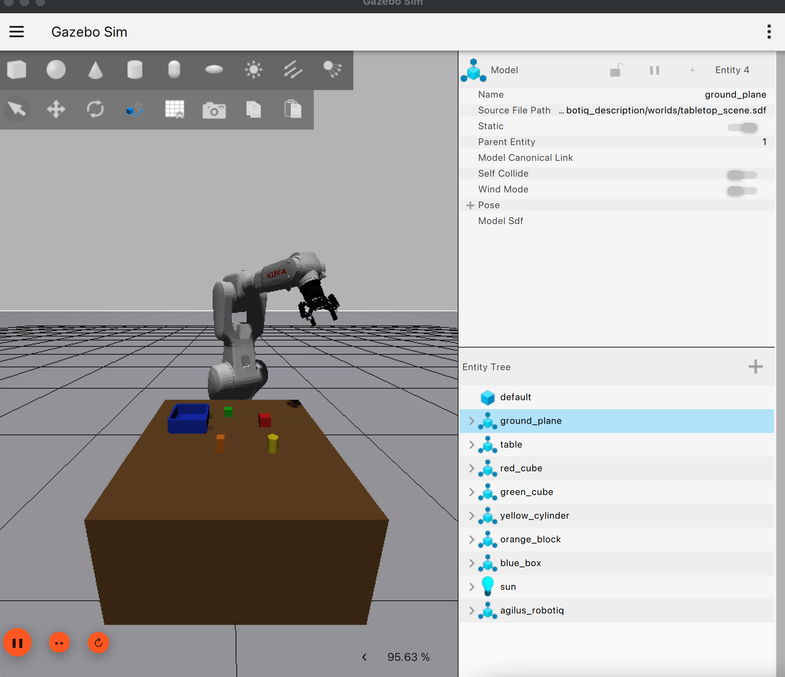
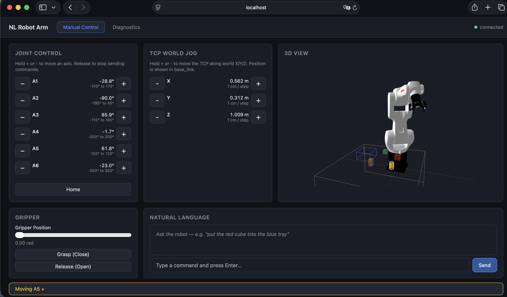

# NL Robot Arm

A simulation-only ROS 2 workspace for commanding a KUKA Agilus KR 16 R1100-3 arm with a Robotiq 2F-85 gripper using natural language. The stack runs the robot in Gazebo Harmonic, exposes typed ROS 2 interfaces, grounds language against a live world model, and executes deterministic arm and gripper skills.

> **Status:** The current implementation targets simulation. It is not a real-time KUKA controller integration and does not require a connected robot.

## What it does

- Simulates the Agilus arm, Robotiq gripper, tabletop, and objects in Gazebo.
- Uses `ros2_control` controllers for simulated arm and gripper motion.
- Provides ground-truth object and grasp-pose services through the world model.
- Converts natural-language requests into typed tool calls through an OpenAI-compatible chat-completions endpoint.
- Grounds object descriptions and synonyms against the objects currently reported by the world model.
- Sequences skills through an orchestrator, including numeric IK, retries, and postcondition checks.
- Offers a GUI when a display is available and a terminal REPL on headless hosts.

The architecture and implementation roadmap are documented in [docs/ARCHITECTURE.md](docs/ARCHITECTURE.md). Operational details are in [docs/how-to-use.md](docs/how-to-use.md).

## Architecture at a glance

```text
Natural-language GUI / terminal REPL
              │  /nl_command
              ▼
     OpenAI-compatible LLM
       (function calling)
              │ typed task
              ▼
        Orchestrator
   (grounding, numeric IK, retry)
              │ ROS 2 actions
              ▼
       Skill action servers
              │
              ▼
 Gazebo + ros2_control simulation
              ▲
              │ bridged poses / state
        World model services
```

The LLM proposes a structured task; it does not directly actuate the robot. The orchestrator resolves object IDs and calls typed ROS 2 actions. Current perception uses Gazebo ground truth rather than camera-based detection.

## Screenshots

### Gazebo simulation

The Agilus arm, Robotiq gripper, tabletop, and scene objects running in Gazebo Harmonic:



### Web UI

The browser-based interface for joint control, TCP jogging, gripper control, diagnostics, and natural-language commands:



## Prerequisites

- Linux on `x86_64` or `aarch64` (the Pixi workspace declares both platforms).
- [Pixi](https://pixi.sh/) installed and available as `pixi`.
- A graphical display only if Gazebo or the NL GUI should be shown; headless operation is supported.
- Network access for the first dependency solve and, when using natural language, access to your configured LLM endpoint.

The project is pinned by `pixi.toml` to Python 3.12, ROS 2 Jazzy, and Gazebo Harmonic packages from RoboStack/conda-forge. The KUKA description and meshes used here are vendored in `src/agilus_robotiq_description`; a separate robot-description checkout is not needed.

## Installation

From the repository root:

```bash
pixi install
pixi run build
```

`pixi run build` executes:

```bash
colcon build --symlink-install --cmake-args -DCMAKE_BUILD_TYPE=Release
```

Optional dependency resolution for packages not supplied by Pixi:

```bash
pixi run deps
```

Enter the activated environment for interactive work:

```bash
pixi shell
```

The activation configures the colcon overlay and Gazebo paths. Run the build before relying on `install/setup.sh`; it does not exist on a fresh checkout.

## Configure the LLM

The natural-language node uses a small `urllib` client and the OpenAI-compatible HTTP endpoint directly; the OpenAI or Anthropic Python SDKs are not required or used by the current implementation. The request is sent to:

```text
{NLRA_LLM_BASE}/chat/completions
```

with a Bearer token, the selected model, messages, and function-calling tools.

### Variables

Set these variables in the environment or in a workspace-root `.env` file. `python-dotenv` loads `.env` when `nlra_nl_interface` starts, and `.env` is ignored by Git.

```dotenv
NLRA_LLM_KEY=replace-with-your-provider-key
NLRA_LLM_BASE=https://api.hcnsec.cn/v1
NLRA_LLM_MODEL=Qwen3.6-35B-A3B
```

- `NLRA_LLM_KEY` is required. Without it, the node starts with a warning but LLM calls fail.
- `NLRA_LLM_BASE` defaults to `https://api.hcnsec.cn/v1`.
- `NLRA_LLM_MODEL` defaults to `Qwen3.6-35B-A3B`.

The code supports any provider that implements the endpoint and request/response shape expected by an OpenAI-compatible `/chat/completions` API, including tool/function calls. The repository specifically records and verifies the Qwen model above; it does not contain separate provider adapters or a local/offline LLM backend. Choose a different model or provider base URL only when that service is compatible with this API. Never commit a real key.

There is currently no committed `.env.example` file, so create `.env` locally (or export the variables in your shell) rather than expecting a template to be installed.

Example using shell variables:

```bash
export NLRA_LLM_KEY='your-secret-key'
export NLRA_LLM_BASE='https://api.hcnsec.cn/v1'
export NLRA_LLM_MODEL='Qwen3.6-35B-A3B'
```

## Run the simulation

Inside `pixi shell`, start the complete stack:

```bash
ros2 launch nlra_bringup nlra.launch.py
```

The default is headless and uses `tabletop_scene.sdf`. Useful launch arguments:

```bash
# Start Gazebo's GUI
ros2 launch nlra_bringup nlra.launch.py gui:=true

# Use another packaged world
ros2 launch nlra_bringup nlra.launch.py world:=empty_bullet.sdf

# Run the simulation without the NL interface/API dependency
ros2 launch nlra_bringup nlra.launch.py nl:=false
```

The full launch starts components as soon as their dependencies are ready (no
fixed delays): the pure-Python stack nodes (pose bridge, world model, skills,
orchestrator, NL interface, web UI) start right after the stale-process reset,
while `move_group` and the skill servers start once a readiness gate observes
the arm controller active. On this host the stack is fully up in ~15 s:

| Approx. time | Components |
| --- | --- |
| 0 s | Gazebo, robot spawn, controllers |
| ~2 s | pose bridge, world model, orchestrator, NL interface, rosbridge, web UI |
| ~10 s | MoveIt move group (after controllers are active) |
| ~12 s | Skill servers (embed the MoveItPy motion planner) |

Wait for startup to finish before sending a command. The NL interface opens a GUI when `DISPLAY` is available and otherwise falls back to a terminal REPL. Startup automatically takes longer on slower hosts.

You can also run a one-off command without entering a shell:

```bash
pixi run ros2 launch nlra_bringup nlra.launch.py
```

For separate components, when their prerequisites are already running:

```bash
ros2 launch agilus_robotiq_description spawn_agilus_robotiq.launch.py gui:=false world:=tabletop_scene.sdf
ros2 launch nlra_skills skills.launch.py
ros2 run nlra_world_model world_model
ros2 run nlra_skills skill_servers
ros2 run nlra_orchestrator orchestrator
ros2 run nlra_nl_interface nl_interface
```

## Natural-language usage

With the full stack running and LLM variables configured, use the terminal REPL on a headless host or the GUI otherwise. Example requests include:

```text
Pick up the red cube and put it in the blue box.
Where would you grasp the red cube?
Move joint a1 to 90 degrees.
Home the robot.
```

The NL layer exposes the `nl_command` service and can also be inspected through ROS 2:

```bash
ros2 service list | grep nl_command
ros2 node list
ros2 action list
```

Supported tool tasks in the current code are `home`, `pick`, `place`, `pick_and_place`, `drop`, `lift`, `plan`, and the raw motion tasks `move_joints`/`move_axis`/`move_relative`/`move_to`/`grasp`/`release`, plus a `get_grasp_pose` query. Multi-object commands like "clean up the desk" are grounded into an `execute_plan` of ordered steps; the LLM receives the full live world state (positions and orientations) and chooses free drop spots (stack or side-by-side) in the tray, with LLM-in-the-loop retry on failure. Grasp poses are computed from the object's full 6-DOF orientation. Joint targets use absolute degrees and joint aliases `a1`–`a6` (also `joint_1`–`joint_6`); the model is instructed about the limits in the source code.

## Inspect and verify a running system

```bash
pixi run ros_check
ros2 node list
ros2 topic list
ros2 action list
ros2 service list
ros2 control list_controllers
ros2 topic echo /joint_states
```

There is currently no formal `pytest`, `ament_cmake_pytest`, or launch-testing suite in the repository. Verification is performed through the Pixi build, ROS graph checks, controller state, and end-to-end simulation behavior.

To stop the stack, press `Ctrl-C` in the launch terminal. If a Gazebo process remains and prevents a clean restart, inspect it first and then use:

```bash
pkill -f 'gz sim'
```

## Repository layout

```text
docs/
  ARCHITECTURE.md                 Design and implementation status
  how-to-use.md                   Detailed operational guide
src/
  agilus_robotiq_description/     URDF, meshes, worlds, controllers
  agilus_robotiq_moveit_config/   MoveIt configuration
  nlra_interfaces/                ROS messages, services, and actions
  nlra_skills/                    Arm/gripper action servers
  nlra_world_model/               Ground-truth object and grasp-pose services
  nlra_orchestrator/              Task grounding, numeric IK, sequencing/retry
  nlra_nl_interface/              LLM-backed /nl_command service and GUI
  nlra_bringup/                   Full-stack launch file
pixi.toml                         Environment, dependencies, and tasks
```

Generated directories such as `.pixi/`, `build/`, `install/`, and `log/` are local artifacts and are not source-of-truth files.

## Troubleshooting

### `NLRA_LLM_KEY not set` or LLM errors

Export `NLRA_LLM_KEY`, check that `NLRA_LLM_BASE` is reachable, and verify that the selected service supports `POST /v1/chat/completions`-style requests with tool calls. The node retries transient failures, but an invalid key or incompatible response cannot be repaired by a retry.

### The robot or services are missing

Allow the staged launch to complete, then inspect `ros2 node list`, `ros2 service list`, and `ros2 action list`. If launching nodes manually, keep the Gazebo pose bridges running because the world model depends on them.

### Gazebo cannot find meshes or plugins

Run from `pixi shell` (or use `pixi run`) after `pixi run build`. Pixi activation supplies `GZ_SIM_SYSTEM_PLUGIN_PATH`, `GZ_SIM_RESOURCE_PATH`, and `GZ_RENDERING_PLUGIN_PATH`.

### Headless rendering problems

Use the default headless launch (`gui:=false`). Camera-based perception is not part of the current implementation; the world model uses Gazebo ground-truth pose bridges.

## Limitations and roadmap

- Simulation only; real KUKA hardware drivers are intentionally not installed.
- Current object poses come from simulation ground truth, not vision.
- Numeric top-down IK is tailored to the tabletop scenario and is not general collision-aware Cartesian planning.
- The NL layer currently depends on a cloud OpenAI-compatible endpoint.
- Multi-step planning now supports generic task sequences (pick/place/drop/lift/…); richer conversational context and spatial reasoning ("left of", "on top of") remain future work.

See [docs/ARCHITECTURE.md](docs/ARCHITECTURE.md) for the detailed roadmap.

## AI development note

The complete project, including its implementation and documentation, was developed with substantial assistance from AI coding tools. Human review, testing, and project direction remain important for evaluating behavior and safety—especially before adapting this simulation stack for physical robot hardware.

## License

The ROS 2 packages in this repository declare Apache-2.0. Consult the individual package metadata and vendored asset licenses before redistributing the complete workspace.

## Contributing

Keep changes scoped to the relevant ROS package, rebuild with `pixi run build`, run the applicable ROS checks or simulation scenario, and review `git diff` before committing. Do not commit `.env`, API keys, generated ROS artifacts, or unrelated local files.

For deeper design context, start with [docs/ARCHITECTURE.md](docs/ARCHITECTURE.md) and [docs/how-to-use.md](docs/how-to-use.md).

_Last reviewed against the as-built workspace configuration and launch files._
